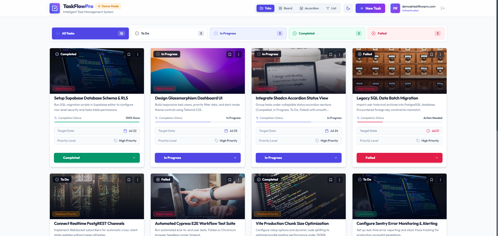

# ⚡ TaskFlow Pro - Intelligent Task Management System

<p align="center">
  
</p>

[](https://react.dev/)
[](https://vitejs.dev/)
[](https://tailwindcss.com/)
[](https://supabase.com/)
[](LICENSE)

**TaskFlow Pro** is a modern, high-performance task management application featuring **Supabase authentication**, PostgreSQL database integration, dynamic multi-view dashboards, and a state-of-the-art **Outfit Google Font** design system with full **Dark/Light theme switching**.

---

## ✨ Key Features

- 📑 **4 Status Tabs View**:
  - **All Tasks**, **To Do**, **In Progress**, **Completed**, and **Failed** status tabs.
  - Active task counters and live status badges for quick navigation.

- 🗂️ **Interactive View Modes**:
  - **Tabs View**: Filter task cards seamlessly by status with active counts.
  - **Kanban Board**: Drag-and-drop workflow across 4 status columns.
  - **Accordion View**: Built using **Shadcn UI Accordion** primitives with forward z-index popover menus.
  - **List View**: Dense tabular data view with instant inline status selectors.

- 🎨 **Glassmorphism Cyber Cards**:
  - Unsplash hero graphics and custom task cover media.
  - Interactive **Completion Activity Progress Bar** tracking task execution state.
  - Contextual action menu (Edit, Delete, Bookmark).
  - High-contrast dynamic status capsule control buttons.

- 🌗 **Shadcn Theme System**:
  - Persistent **Dark Mode** & **Light Mode** toggle.
  - Ambient glow gradients and curated HSL color palettes.

- 📐 **Standardized `rounded-md` Design System**:
  - Strict compliance with `rounded-md` (0.375rem border-radius) on all cards, buttons, popovers, badges, and modals.
  - Uses Google **Outfit** font exclusively across the entire application.

- 🔐 **Supabase Auth & PostgreSQL Integration**:
  - Full email authentication & secure session management.
  - Fallback interactive **Demo Mode** for immediate previewing.

---

## 🛠️ Technology Stack

- **Frontend Core**: React 18, Vite 5, JavaScript (ES6+)
- **Styling & Design System**: Tailwind CSS 3.4, Vanilla CSS
- **Typography**: Outfit Google Font
- **Icons**: Lucide React
- **Backend & Auth**: Supabase (PostgreSQL + Row Level Security)

---

## 📁 Project Structure

```
taskflow-pro/
├── public/                  # Public static assets (taskflow.png)
├── src/
│   ├── components/          # Application UI components
│   │   ├── ui/             # Shadcn UI primitives (Accordion, Custom Select)
│   │   ├── AccordionView.jsx
│   │   ├── AuthForm.jsx
│   │   ├── KanbanBoard.jsx
│   │   ├── ListView.jsx
│   │   ├── Navbar.jsx
│   │   ├── TabsView.jsx
│   │   ├── TaskCard.jsx
│   │   ├── TaskModal.jsx
│   │   └── Toast.jsx
│   ├── context/             # ThemeContext (Dark / Light mode)
│   ├── hooks/               # Custom hooks (useAuth, useTasks)
│   ├── lib/                 # Supabase client configuration
│   ├── App.jsx              # Main Dashboard Layout
│   ├── index.css            # Global CSS & Outfit font enforcement
│   └── main.jsx             # React root entry point
├── supabase/                # PostgreSQL schema & RLS policies
├── index.html               # HTML template with Outfit font import
├── tailwind.config.js       # Tailwind configuration & Outfit font-family
├── vite.config.js           # Vite dev & build configuration
└── package.json
```

---

## 🚀 Getting Started

### Prerequisites

- **Node.js** (v18.0.0 or higher)
- **npm** or **yarn**

### 1. Clone Repository

```bash
git clone https://github.com/CoderGUY47/FR-3-Taskflow-Pro.git
cd FR-3-Taskflow-Pro
```

### 2. Install Dependencies

```bash
npm install
```

### 3. Configure Environment Variables

Create a `.env` file in the root directory:

```env
VITE_SUPABASE_URL=https://your-supabase-project-id.supabase.co
VITE_SUPABASE_ANON_KEY=your-supabase-anon-key
```

> **Note**: If environment variables are omitted, TaskFlow Pro automatically runs in **Demo Mode** with 12 pre-loaded sample tasks.

### 4. Run Locally

```bash
npm run dev
```

Open `http://localhost:5173` in your browser.

---

## 📦 Production Build

To test or generate the production build bundle:

```bash
npm run build
```

---

## 📄 License

Distributed under the MIT License. See `LICENSE` for details.
